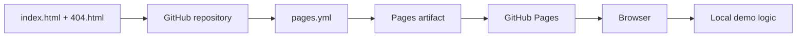
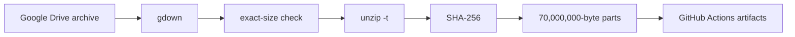

# 🌐 SINERGYCHAIN Growth OS — verified GitHub Pages technical dossier

> **Статус:** 🟡 CANDIDATE presentation/demo surface.
> **Тип:** static GitHub Pages application + CI workflows.
> **Проверено по фактическому `main`:** 29.09.2026.

## 1. 🎯 Назначение

`synergychain.github.io` — публичный presentation/demo слой SINERGYCHAIN Growth OS. Он показывает интерфейс и product concepts, но **не является** backend, бухгалтерским ledger, payment authority, AI model runtime или source of truth.

Главная архитектурная граница:

```text
static UI
!=
backend runtime
!=
accounting truth
!=
settlement
```

## 2. 📦 Фактическое дерево `main`

```text
synergychain.github.io/
├── .github/
│   └── workflows/
│       ├── pages.yml
│       └── split-roboforex-drive.yml
├── .nojekyll
├── 404.html
├── DEPLOY_TRIGGER
├── README.md
└── index.html
```

Это компактный static-site repository с двумя automation workflows.

## 3. 🖥️ Что реально реализовано в `index.html`

`index.html` — single-file HTML/CSS/JS application размером около 33 KB в текущем tree.

В UI присутствуют отдельные presentation/demo views:

- Portal / home;
- OLGA AGI;
- Business Autopilot;
- AI SMM;
- AI CRM;
- AI Sales;
- AI CFO;
- API Vault.

Страница содержит responsive layout, local interactions, navigation, animated visual layer и демонстрационные business calculations/flows.

В самом UI прямо указано, что демонстрация работает локально, а реальные модели должны подключаться через защищённый backend. Это правильная граница: backend в данном repo отсутствует.

## 4. 🏗️ Архитектура сайта



Никакой server-side authority эта цепочка не создаёт.

## 5. 🚀 Реальный deployment workflow

`.github/workflows/pages.yml`:

- запускается на push в `main` и вручную;
- использует `actions/checkout@v4`;
- `actions/configure-pages@v5`;
- `actions/upload-pages-artifact@v4`;
- `actions/deploy-pages@v4`;
- имеет `pages: write` и `id-token: write`;
- публикует repository root как static artifact.

Это фактический deploy path, а не roadmap.

## 6. 📦 Второй workflow: RoboForex archive split

`.github/workflows/split-roboforex-drive.yml` — отдельный data utility workflow, не backend сайта.

Фактический pipeline:



Workflow:

- скачивает `RoboForex_Top_History200001.zip`;
- проверяет exact size = **142,821,769 bytes**;
- выполняет `unzip -t`;
- считает SHA-256 полного архива;
- режет файл по 70,000,000 bytes;
- считает SHA-256 частей;
- создаёт инструкции reassemble;
- загружает три parts и checksums;
- retention artifacts = 1 day.

Важно: этот workflow обслуживает исторический data artifact и **не превращает сайт в market-data authority**.

## 7. 📥 Inputs

### Static site

- committed HTML/CSS/JS;
- browser;
- local user interaction.

### Archive workflow

- внешний Google Drive file;
- exact expected byte size;
- GitHub Actions runner.

## 8. 📤 Outputs

### Pages

- static GitHub Pages artifact;
- browser-rendered demo.

### Data workflow

- split archive parts;
- archive SHA-256;
- part SHA-256 files;
- reassembly instructions.

## 9. 🛡️ Authority boundaries

```text
displayed balance        != ledger balance
demo calculation         != audited result
local UI success         != external settlement
HTML metric              != verified metric
static API-vault UI      != secure secret vault
JavaScript state         != backend state
published investment/AI claim != engineering evidence
historical data artifact != live market feed
```

## 10. 🔐 Security model

### Static site

Обязательные правила:

- никаких production API keys в HTML/JS;
- никаких raw private keys;
- client-side validation не считается authorization;
- browser local state не считается trusted storage;
- внешние actions/dependencies должны быть pinned/reviewed;
- public metrics должны иметь evidence links.

### GitHub Actions

Текущий Pages workflow использует versioned major actions. Для более строгой supply-chain модели следующий уровень — pin actions к immutable commit SHA.

Data workflow загружает файл из внешнего source; exact-size и ZIP integrity уже проверяются, но доверие к содержимому усиливается сохранённым expected SHA-256.

## 11. ⚠️ Failure modes

| Failure | Риск |
|---|---|
| stale marketing copy | UI расходится с реальностью federation |
| demo result воспринимается как production | ложный operational claim |
| secret inserted into static JS | мгновенная публичная утечка |
| compromised external action | supply-chain risk |
| source archive changed, same size | size check не ловит подмену |
| temporary data artifacts expire | reproduction теряется |
| public metric no evidence URL | claim нельзя проверить |

## 12. 🧪 Required tests / gates

Для static surface:

- HTML validation;
- broken-link checker;
- accessibility/Lighthouse smoke;
- responsive smoke;
- no-secret scan;
- static asset existence;
- CSP review;
- claims-to-evidence lint.

Для archive workflow:

- expected SHA-256 before split;
- reassembled SHA == original SHA;
- part count and sizes;
- corrupted-part negative test;
- deterministic split manifest.

## 13. 🛠️ Воспроизводимость

### Local site

```bash
git clone https://github.com/Shtenco/synergychain.github.io.git
cd synergychain.github.io
python -m http.server 8000
```

Открыть localhost:8000.

### Pages

Canonical deploy specification находится в `.github/workflows/pages.yml`.

### Archive utility

Canonical workflow находится в `.github/workflows/split-roboforex-drive.yml`. Его успешный future run должен сохраняться как observed evidence, а не выводиться из наличия YAML.

## 14. 🗺️ Карта репозитория

| Путь | Роль |
|---|---|
| `index.html` | основной static demo |
| `404.html` | redirect to `#home` |
| `.nojekyll` | Pages static handling |
| `DEPLOY_TRIGGER` | deploy-touch artifact |
| `.github/workflows/pages.yml` | Pages deployment |
| `.github/workflows/split-roboforex-drive.yml` | archive split/checksum utility |
| `README.md` | verified technical dossier |

## 15. 🔗 Место в SYNERGY

Presentation-layer связи:

- [`synergy_apps`](https://github.com/Shtenco/synergy_apps);
- [`sinergy_super_app`](https://github.com/Shtenco/sinergy_super_app);
- [`synergy_ai_blockchain`](https://github.com/Shtenco/synergy_ai_blockchain);
- [`synergy_system`](https://github.com/Shtenco/synergy_system).

Сайт может **показывать** verified artifacts этих систем, но не получает их authority.

## 16. 📊 Evidence maturity

| Layer | Status |
|---|---|
| static source | ✅ |
| local demo logic | ✅ |
| Pages workflow | ✅ |
| archive workflow | ✅ |
| backend/API runtime | ❌ |
| real AI model connection | ❌ in this repo |
| accounting authority | ❌ |
| automated claims evidence | ❌ |
| observed current CI evidence | не утверждается README |
| production financial operations | ❌ |

## 17. 🚀 Roadmap

1. разбить single-file demo на maintainable modules, если рост продолжится;
2. structured claims manifest;
3. evidence URLs для каждой числовой метрики;
4. link/accessibility/html validation;
5. secret scan;
6. CSP/SRI strategy;
7. immutable action pins;
8. archive expected SHA-256;
9. persistent data provenance manifest;
10. read-only typed backend integration только через canonical authorities.

## 18. 🛑 Что проект НЕ утверждает

- что OLGA/MIDAS/CRM/CFO backend реализован в этом repository;
- что local demo является production AI;
- что UI имеет финансовую authority;
- что любые числовые claims на странице автоматически доказаны;
- что RoboForex archive workflow является live feed;
- что static API Vault безопасно хранит production secrets.

---

[🧭 SYNERGY SYSTEM](https://github.com/Shtenco/synergy_system) · [📚 Атлас 75 репозиториев](https://github.com/Shtenco/synergy_system/blob/main/docs/SYNERGY_REPOSITORY_ATLAS.md) · [🧾 Registry](https://github.com/Shtenco/synergy_system/blob/main/registry/SYNERGY_REPOSITORIES.json)
