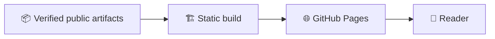

# SINERGYCHAIN Growth OS V7 — GitHub Pages

Public static presentation build only. Backend, databases, API keys and private runtime data are not included.

The bootstrap service worker expands the verified static bundle in the browser and serves the complete portal under this repository's GitHub Pages scope.


---

# 🌐 Архитектурная роль сайта

`synergychain.github.io` — **presentation-only** слой. Это принципиально важно: статический GitHub Pages не должен становиться вторым backend, ledger или trust authority.



## Граница утверждений

- опубликованный текст не доказывает live runtime;
- визуализированная метрика не считается аудированной без source artifact;
- JavaScript в браузере не имеет права подменять blockchain/accounting state;
- private runtime data и keys не должны попадать в static bundle.

## Связи

- [`synergy_chain`](https://github.com/Shtenco/synergy_chain);
- [`synergy_ai_blockchain`](https://github.com/Shtenco/synergy_ai_blockchain);
- [`synergy_system`](https://github.com/Shtenco/synergy_system).

[📚 Атлас 75 репозиториев](https://github.com/Shtenco/synergy_system/blob/main/docs/SYNERGY_REPOSITORY_ATLAS.md)


---

# 🌐 Глубокий технический паспорт GitHub Pages build

## Фактический `main`

```text
index.html
404.html
.nojekyll
DEPLOY_TRIGGER
.github/workflows/pages.yml
.github/workflows/split-roboforex-drive.yml
README.md
```

Это компактный **static deployment repository**. Отдельный workflow `split-roboforex-drive.yml` означает, что рядом с обычным Pages deploy есть data/file-processing automation; её выход не должен автоматически считаться backend authority сайта.

## Supply chain


## Gates

- Pages workflow must pin trusted actions;
- no secrets/runtime credentials in static artifacts;
- every public metric must link to its source;
- large-data workflows must not silently alter presentation claims;
- CSP/SRI strategy should be documented if external resources are used.
